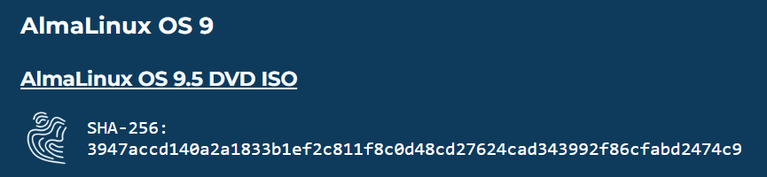

 
+++
title = "ATELIER: Installation de Linux sur une VM"
weight = 14
+++

#### Objectif
Cet atelier a pour but de vous guider à travers le processus d'installation de Linux sur une machine virtuelle (VM). Cela permet d'expérimenter avec Linux sans affecter le système d'exploitation principal de l'ordinateur.

#### Prérequis
- Un ordinateur avec un système d'exploitation Windows, macOS ou Linux.
- Une connexion Internet.
- Un logiciel de virtualisation tel que VirtualBox (gratuit) ou VMware Workstation.

#### Étapes de l'atelier

1. **Téléchargement du logiciel de virtualisation**
   - **VirtualBox** : Téléchargez et installez VirtualBox depuis le site officiel [VirtualBox](https://www.virtualbox.org/).
   - **VMware** : Téléchargez et installez VMware Workstation Player depuis le site officiel [VMware](https://www.vmware.com/products/workstation-player.html).

2. **Téléchargement de l'Image ISO de Linux**
   - Choisissez une distribution Linux (par exemple, Ubuntu, Fedora, Debian).
   - Téléchargez l'image ISO de la distribution choisie depuis son site officiel. Par exemple, pour Ubuntu, visitez [Ubuntu](https://ubuntu.com/download).
   - Téléchargez l'image ISO de la distribution choisie depuis son site officiel. Par exemple, pour Alma Linux, visitez [Alma Linux](https://almalinux.org/get-almalinux/)

3. **Création d'une nouvelle machine virtuelle**
   - Ouvrez VirtualBox ou VMware.
   - Cliquez sur "Nouvelle" pour créer une nouvelle machine virtuelle.
   - Donnez un nom à votre VM (par exemple, "Linux VM") et sélectionnez le type et la version du système d'exploitation (par exemple, Linux et Ubuntu 64-bit).
   - Allouez de la mémoire RAM à la VM (au moins 2 Go recommandés).
   - Créez un disque dur virtuel en suivant les instructions (taille recommandée : au moins 20 Go).

4. **Configuration de la machine virtuelle**
   - Sélectionnez la VM nouvellement créée et cliquez sur "Paramètres".
   - Allez dans l'onglet "Stockage" et ajoutez un lecteur optique virtuel.
   - Sélectionnez l'image ISO de Linux que vous avez téléchargée précédemment.

5. **Démarrage de la machine virtuelle**
   - Sélectionnez la VM et cliquez sur "Démarrer".
   - La VM démarrera à partir de l'image ISO et vous verrez l'écran d'installation de Linux.

6. **Installation de Linux**
   - Suivez les instructions à l'écran pour installer Linux. Cela inclut la sélection de la langue, la configuration du réseau, le partitionnement du disque, et la création d'un compte utilisateur.
   - Une fois l'installation terminée, redémarrez la VM.

7. **Post-Installation**
   - Après le redémarrage, retirez l'image ISO du lecteur optique virtuel pour éviter de redémarrer sur l'installateur.
   - Connectez vous avec le compte utilisateur que vous avez créé.
   - Mettez à jour le système et installez les logiciels nécessaires via le gestionnaire de paquets de la distribution (par exemple, `apt` pour Ubuntu).

Félicitations ! Vous avez maintenant une machine virtuelle Linux fonctionnelle. Vous pouvez utiliser cette VM pour explorer Linux, installer des logiciels, et pratiquer des commandes sans risquer de perturber votre système principal.

