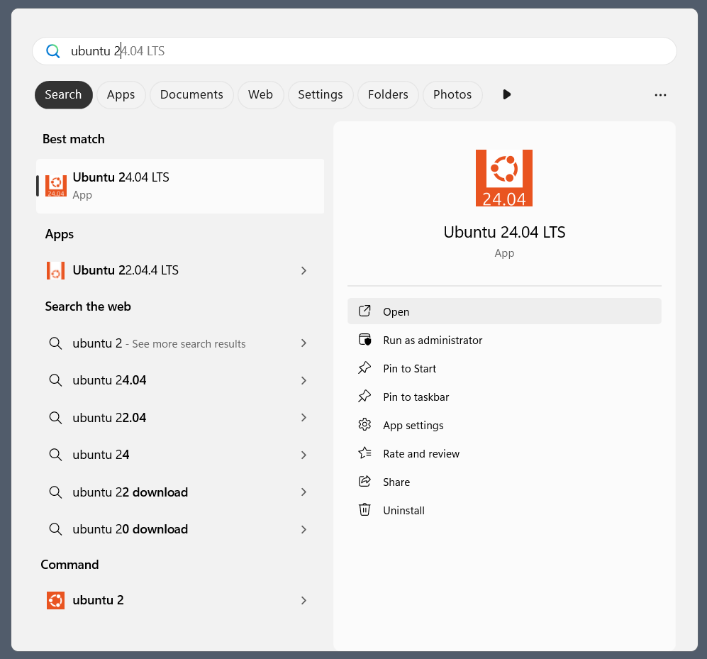

 
+++
title = "ATELIER: Les commandes Linux de base"
weight = 24
+++

A FAIRE
- Indiquer les commandes à utiliser
- Désinstaller Ubuntu et reinstaller en prenant captures
- Indiquer de prendre la plu récente version d'Ubuntu
- ajouter objectifs pour Ubuntu
- Ajouter exos avec etc/ et historique (ajouter dans matière cours)

## Préalables

### 1. Installation et activation de *Windows Subsystem for Linux* (WSL)

1. Rechercher les fonctionnalités Windows

### Installation de *Windows Subsystem for Linux* (WSL)

2. Dans la liste, cocher ***Sous-Système Windows pour Linux**

3. Redémarrer

Vous pouvez maintenant installer la distribution Ubuntu depuis le Microsoft Store.

### Installation d'Ubuntu WSL

WSL prend en charge une variété de distributions Linux, y compris la dernière version LTS d'Ubuntu. 

Il existe plusieurs façons d'installer des distributions sur WSL, nous nous concentrons ici sur deux méthodes : Via l'application dans Microsoft Store et les commandes WSL exécutées dans le terminal. Le résultat est le même quelle que soit la méthode.

**Méthode 1 : Application dans Microsoft Store**

Trouvez la distribution que vous préférez sur le Microsoft Store, cliquez sur **Gratuit**, puis sur **Obtenir**.

Dans la fenêtre Ubuntu: patienter durant l’installation

Ubuntu sera alors installé sur votre machine. Une fois installé, vous pouvez soit lancer l'application directement depuis le Microsoft Store, soit rechercher Ubuntu dans votre barre de recherche Windows.

---
**References**:  
1. [Site Ubuntu WSL](https://documentation.ubuntu.com/wsl/en/latest/guides/install-ubuntu-wsl2/)
2. [Vidéo YouTube](https://youtu.be/HrAsmXy1-78?si=VyvuNbkGmthsnLAI)

## Objectif de l'atelier

Cet atelier a pour but de vous familiariser avec les commandes simples et de base sous Linux. Les exercices pratiques permettront de renforcer la compréhension et l'utilisation de ces commandes.

{}
Votre Windows 10/11 de votre VM doit être à jour.
{}

## Mettre à jour Windows

**Pour Windows 10**:

Cliquer sur [Mise à jour de Windows 10](https://www.microsoft.com/fr-ca/software-download/windows10) et cliquer sur **Mettre à jour maintenant.**

**Pour Windows 11**:

Cliquer sur [Installer Windows Mise à jour](https://support.microsoft.com/fr-fr/windows/mettez-%C3%A0-jour-windows-3c5ae7fc-9fb6-9af1-1984-b5e0412c556a#WindowsVersion=Windows_11), puis cliquer sur **Rechercher les mises à jour de Windows** et suivre les étapes.

## Atelier

Ouvrez un terminal Ubuntu.

1. **Afficher la date et l'heure actuelles du système.**
     - Tapez la commande pour afficher la date et l'heure actuelles.
     - Observez la sortie qui affiche la date et l'heure actuelles du système.

2. **Changer le mot de passe de l'utilisateur.**
     - Tapez la commande pour changer le mot de passe.
     - Entrez votre mot de passe actuel lorsque vous y êtes invité.
     - Entrez votre nouveau mot de passe et confirmez-le.

3. **Afficher le contenu d'un fichier.**
     - Créez un fichier texte avec du contenu.
     - Tapez la commande pour afficher le contenu du fichier.
     - Observez la sortie qui affiche le contenu du fichier.

4. **Afficher le contenu d'un fichier page par page.**
     - Tapez la commande pour afficher le contenu d'un fichier page par page.
     - Utilisez les touches suivantes pour naviguer :
        - `Espace` : Page suivante
        - `b` : Page précédente
        - `q` : Quitter

5. **Afficher les premières lignes d'un fichier.**
     - Tapez la commande pour afficher les premières lignes d'un fichier.
     - Pour afficher un nombre spécifique de lignes, utilisez l'option appropriée.

6. **Afficher les dernières lignes d'un fichier.**
     - Tapez la commande pour afficher les dernières lignes d'un fichier.
     - Pour afficher un nombre spécifique de lignes, utilisez l'option appropriée.
     - Pour afficher les nouvelles lignes ajoutées en temps réel, utilisez l'option appropriée.

7. **Exécuter plusieurs commandes sur une seule ligne.**
     - Tapez la commande pour exécuter plusieurs commandes sur une seule ligne.
     - Observez la sortie qui affiche les résultats des commandes exécutées.

8. **Afficher le chemin complet du répertoire courant.**
     - Tapez la commande pour afficher le chemin complet du répertoire courant.
     - Observez la sortie qui affiche le chemin complet du répertoire courant.

9. **Lister les fichiers et répertoires dans le répertoire courant.**
     - Tapez la commande pour lister les fichiers et répertoires dans le répertoire courant.
     - Pour afficher les détails des fichiers et répertoires, utilisez l'option appropriée.
     - Pour afficher tous les fichiers, y compris les fichiers cachés, utilisez l'option appropriée.
     - Pour afficher les tailles de fichiers dans un format lisible, utilisez l'option appropriée.

10. **Changer le répertoire courant.**
      - Tapez la commande pour aller dans le répertoire `/home`.
      - Tapez la commande pour vérifier le répertoire courant.
      - Tapez la commande pour remonter d'un niveau dans l'arborescence des répertoires.
      - Tapez la commande pour vérifier le répertoire courant.
      - Tapez la commande pour aller directement au répertoire personnel de l'utilisateur.
      - Tapez la commande pour vérifier le répertoire courant.

11. **Créer un nouveau répertoire.**
      - Tapez la commande pour créer un nouveau répertoire.
      - Tapez la commande pour vérifier que le répertoire a été créé.

12. **Supprimer un répertoire vide.**
      - Tapez la commande pour supprimer le nouveau répertoire créé au #11.
      - Tapez la commande pour vérifier que le répertoire a été supprimé.

13. **Supprimer des fichiers ou des répertoires.**
      - Créez des fichiers pour l'exercice.
      - Tapez la commande pour supprimer un fichier.
      - Tapez la commande pour vérifier que le fichier a été supprimé.
      - Tapez la commande pour forcer la suppression d'un fichier sans confirmation.
      - Tapez la commande pour vérifier que le fichier a été supprimé.

14. **Copier des fichiers ou des répertoires.**
      - Créez un fichier pour l'exercice.
      - Tapez la commande pour copier un fichier.
      - Tapez la commande pour vérifier que le fichier a été copié.
      - Créez un répertoire pour l'exercice.
      - Tapez la commande pour copier un fichier dans un répertoire.
      - Tapez la commande pour vérifier que le fichier a été copié dans le répertoire.

15. **Déplacer ou renommer des fichiers ou des répertoires.**
      - Tapez la commande pour renommer un fichier.
      - Tapez la commande pour vérifier que le fichier a été renommé.
      - Tapez la commande pour déplacer un fichier dans un répertoire.
      - Tapez la commande pour vérifier que le fichier a été déplacé dans le répertoire.